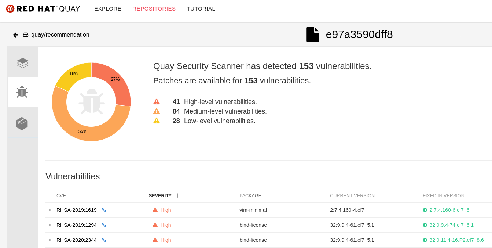

# Quay and Clair PoC Demo

### Push some images to the Quay Registry deployed with the Quay Operator

1. Pull & Push customer and recommendation images from quay SaaS to the Quay on premise registry

* Pull and Push a customer image

```
podman pull quay.io/rcarrata/customer

export QUAY_URL=$(oc get route -n quay-enterprise rober-quayecosystem-quay -o jsonpath={.spec.host})
ID_CUST=$(podman images quay.io/rcarrata/customer | grep rcarrata | awk '{ print $3 }')

podman login --tls-verify=false $QUAY_URL

podman tag $ID_CUST $QUAY_URL/quay/customer

podman push --tls-verify=false $QUAY_URL/quay/customer
```

* Pull and Push a recommendation image

```
podman pull quay.io/rcarrata/recommendation:vertx

ID_CUST=$(podman images quay.io/rcarrata/recommendation | grep rcarrata | awk '{ print $3 }')

podman tag $ID_CUST $QUAY_URL/quay/recommendation

podman push --tls-verify=false $QUAY_URL/quay/recommendation
```

### Check the Vulnerabilities of the images

2. Check in the QUAY_URL the images and check the vulnerabilities

```
echo $QUAY_URL
```

NOTE: Once Clair is running, it takes several minutes to obtain all the CVEs from the repo.
If you upload an images and all is in Passed state, wait a couple of minutes and check again the Security Scan once is published

3. Go to one repository -> Check Tags -> Go to Security Scan (takes a bit in finishing the report)



### Using Skopeo for Copy images directly from other registry to our brand-new Quay

* From Quay.io (SaaS) to Quay in OCP

```
skopeo copy --dest-creds quay:password --dest-tls-verify=false \
docker://quay.io/rcarrata/partner:sb docker://${QUAY_URL}/quay/partner
```

* Promoting Apps between different stages (from dev to prod)

```
skopeo copy --src-tls-verify=false --src-creds quay:password  --dest-creds quay:password --dest-tls-verify=false docker://${QUAY_URL}/quay/partner:latest docker://${QUAY_URL}/quay/partner:prod
```

* From Dockerhub.io to Quay in OCP

```
skopeo copy  --dest-creds quay:password --dest-tls-verify=false \
docker://docker.io/redislabs/redis:5.0.2-30 docker://${QUAY_URL}/quay/redis:5.0.2-30
```

```
skopeo copy  --dest-creds quay:password --dest-tls-verify=false docker://docker.io/bitnami/mongodb:latest doc
ker://${QUAY_URL}/quay/mongodb:latest
```

* From Quay.io (SaaS) to Quay in OCP


