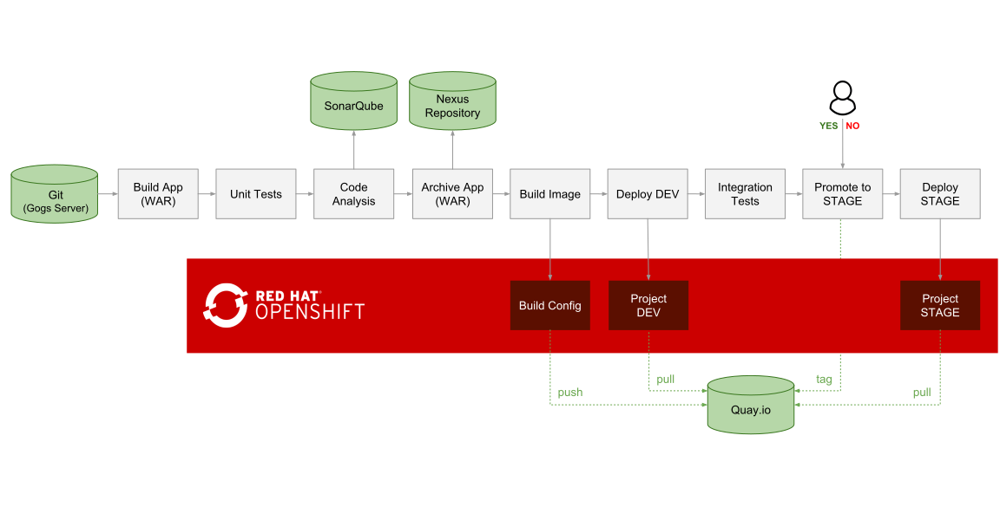

## Deploy Quay & Clair Pipelines

This pipeline includes continuous delivery using Jenkins, Nexus, SonarQube and Clair on Openshift
SonarQube



### Steps to deploy the pipeline

```
git clone https://github.com/siamaksade/openshift-cd-demo.git
```

```
oc new-project dev --display-name="Tasks - Dev"
oc new-project stage --display-name="Tasks - Stage"
oc new-project cicd --display-name="CI/CD"
```

```
oc policy add-role-to-group edit system:serviceaccounts:cicd -n dev
oc policy add-role-to-group edit system:serviceaccounts:cicd -n stage
```

And then deploy the demo:

```
oc new-app jenkins-ephemeral -n cicd
oc new-app -n cicd -f cicd-template.yaml -p ENABLE_QUAY=True -p QUAY_USERNAME="xxxx" -p QUAY_PASSWORD="xxxxx"
```

### Pipeline Execution

* On every pipeline execution, the code goes through the following steps:

```
1. Code is cloned from Gogs, built, tested and analyzed for bugs and bad patterns
2. The WAR artifact is pushed to Nexus Repository manager
3. A container image (tasks:latest) is built based on the Tasks application WAR artifact deployed on WildFly
4. If Quay.io is enabled, the Tasks app container image is pushed to the quay.io image registry and a security scan is scheduled
5. The Tasks container image is deployed in a fresh new container in DEV project (pulled form Quay.io, if enabled)
6. If tests successful, the pipeline is paused for the release manager to approve the release to STAGE
7. If approved, the DEV image is tagged in the STAGE project. If Quay.io is enabled, the image is tagged in the Quay.io image repository using Skopeo
8. The staged image is deployed in a fresh new container in the STAGE project (pulled form Quay.io, if enabled)
```
